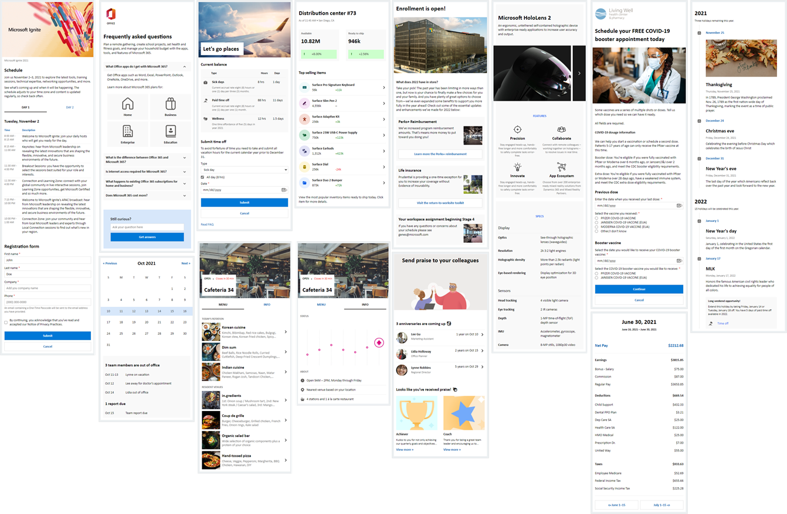

# Adaptive Card templates - design examples

Samples on different Adaptive Card designs for Viva Connections, demonstrating the art of possible for inspiration and innovation. Shared designs can be used as such or as a starting point for your own designs.

Here's a teaser of some of the provided designs.

## Additional resources

* [Adaptive Cards Documentation](https://adaptivecards.io/)
* [Adaptive Cards Designer](https://adaptivecards.io/)
* [Made with Cards](https://madewithcards.io/)
* [Designing Viva Connections custom cards for your dashboard](https://docs.microsoft.com/en-us/sharepoint/dev/spfx/viva/design/design-intro)
* [Card Designer Advance API Features](https://learn.microsoft.com/en-us/sharepoint/dev/spfx/viva/features/card-designer/card-designer-api-support)

## Advance API Features

A number of the samples support the 'Advance API Features' Card Designer functionality. Samples that support the Advance API Features are clearly marked in the README files. 

This functionality allows dashboard editors to call the Microsoft Graph and SharePoint REST APIs without actual code.

Read the [Overview of Viva Connections Card Designer advance API features](https://learn.microsoft.com/en-us/sharepoint/dev/spfx/viva/features/card-designer/card-designer-api-support) documentation to learn more.

## Authors

This repository's contributors are all community members who volunteered their time to share code samples. Work is done as an open source community project, with each sample contained in their own solution.

## Contributions

These samples are direct from the feature teams, SharePoint PnP core team (http://aka.ms/m365pnp) or shared by the community. We welcome your input on issues and suggestions for new samples. We do also welcome community contributions around the different adaptive design sample. If you have any questions, just let us know.

Please have a look on our [Contribution Guidance](./CONTRIBUTING.md) before submitting your pull requests, so that we can get your contribution processed as fast as possible.

> Sharing is caring!