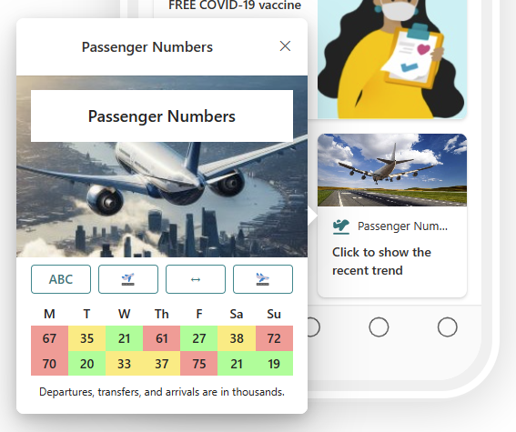
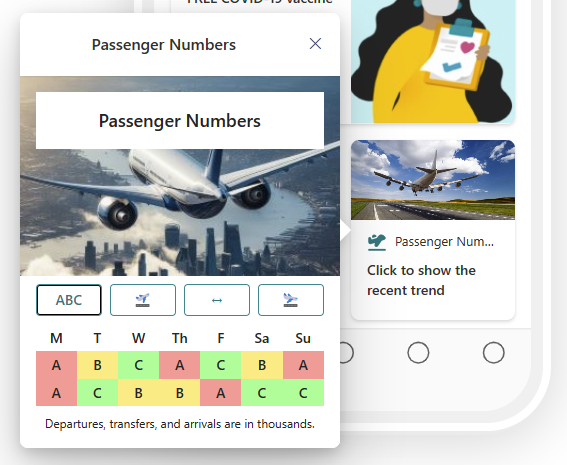
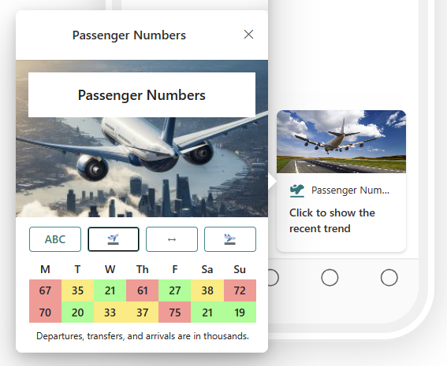

# Airport Passenger Numbers

## Summary

A Viva Connections adaptive card made for an airport to show the recent trend of daily passenger numbers for arrivals, transfers, and departures. This card is currently static and would ideally be updated to connect to real time data. It's provided here as a design template. Clicking on each of the buttons across the middle show the data for each view: an A/B/C "busy-ness" rating, number of departing passengers in thousands, number of transferring passengers, and number of arriving passengers.

## Compatibility

## Advance API Features

## Designer

    

## Solution

Solution|Author(s)
--------|---------
airport-passengers | [Chris Slemp](https://github.com/chslemp), Microsoft

## Version history

Version|Date|Comments
-------|----|--------
1.0|February 29, 2024|Initial release

## Disclaimer
**THIS CODE IS PROVIDED *AS IS* WITHOUT WARRANTY OF ANY KIND, EITHER EXPRESS OR IMPLIED, INCLUDING ANY IMPLIED WARRANTIES OF FITNESS FOR A PARTICULAR PURPOSE, MERCHANTABILITY, OR NON-INFRINGEMENT.**

## Minimal Path to Awesome

This design is originally created for Viva Connections Dashboard cards and can be used for story telling with the out of the box **Card designer** card for Viva Connections dashboard.

> See more details on the Viva Connections Dashboard capabilities from [Microsoft documentation](https://docs.microsoft.com/en-us/viva/connections/create-dashboard).

Steps to configure this card with *Card designer* as follows:

- Add **Card designer** to the Viva Connections Dashboard
- **Template Type** - Image
- **Card size** - Medium
- **Title** - *Passenger Numbers*
- **Icon** - Icon with the preferred selection, suggest airplane
- **Heading** - *Click to show the recent trend*
- **Image** - Upload your choice or use landing.jpg in assets folder
- **Card action** - Show the quick view
- **Primary Button** - Off
- **Secondary Button** - Off
- **Template JSON** - Paste in the content of the *flightstemplate.json* file
- **Data JSON** - Paste in the content of the *flightsdata.json* file

## Help

We do not support samples, but we this community is always willing to help, and we want to improve these samples. We use GitHub to track issues, which makes it easy for  community members to volunteer their time and help resolve issues.

You can try looking at [issues related to this sample](https://github.com/pnp/AdaptiveCards-Templates/issues) to see if anybody else is having the same issues.

[def]: http