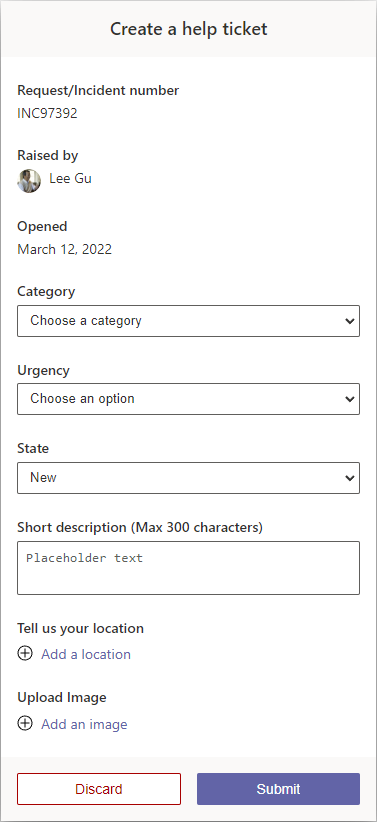
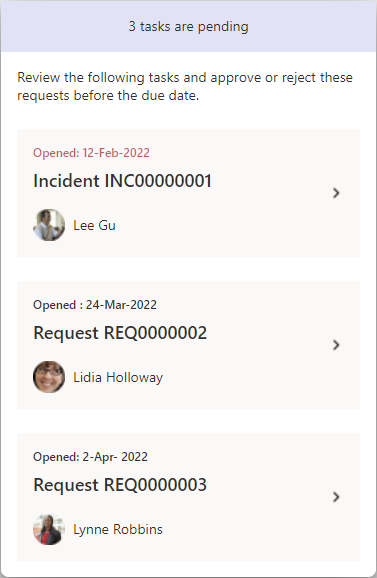
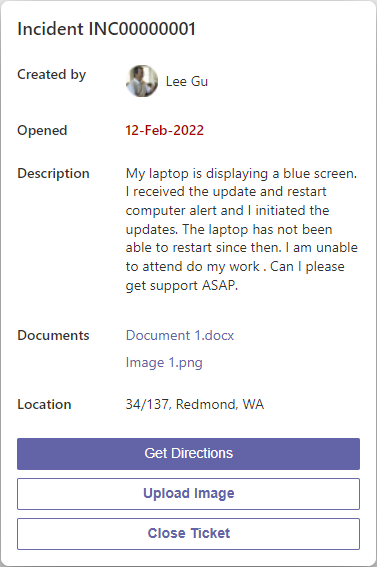
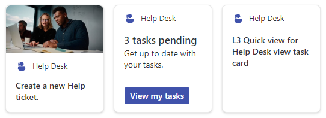

# Help desk design - for creating and handling

## Summary

Designs for creating new help desk tickets and to start processing them from the queue using Viva Cards. Three separate quick view designs.

**Create a ticket**

**List tickets**

**Details on individual ticket**

## Compatibility

## Advance API Features

## Designer

**Create a ticket**

    

**List tickets**

    

**Details on individual ticket**

    

## Solution

Solution|Author(s)
--------|---------
help-desk | Max Kulakov (Microsoft), Cathrine Chuaga (Microsoft), [Vesa Juvonen](https://github.com/vesajuvonen) ([@vesajuvonen](https://twitter.com/vesajuvonen)) - Microsoft

## Version history

Version|Date|Comments
-------|----|--------
1.0|April 14, 2021|Initial release

## Disclaimer
**THIS CODE IS PROVIDED *AS IS* WITHOUT WARRANTY OF ANY KIND, EITHER EXPRESS OR IMPLIED, INCLUDING ANY IMPLIED WARRANTIES OF FITNESS FOR A PARTICULAR PURPOSE, MERCHANTABILITY, OR NON-INFRINGEMENT.**

## Minimal Path to Awesome

This design is originally created for Viva Connections Dashboard cards and can be used for story telling with the out of the box **Card designer** card for Viva Connections dashboard.

> See more details on the Viva Connections Dashboard capabilities from [Microsoft documentation](https://docs.microsoft.com/en-us/viva/connections/create-dashboard).

Steps to configure this card with *Card designer* as follows:

**Create a ticket**

- Add **Card designer** to the Viva Connections Dashboard
- **Template Type** - Image
- **Card size** - Medium
- **Title** - *Help Desk*
- **Icon** - Icon with the preferred selection - **"person_support"** used in pic
- **Heading** - *Create a new Help ticket.*
- **Image** - Custom image - upload helpdesk.jpeg from the assets folder as the image
- **Card action** - Show the quick view
- **Primary Button** - Off
- **Secondary Button** - Off
- **Template JSON** - Paste in the content of the *ac-qv-event.json* file
- **Data JSON** - *not impactful*

**List tickets**

- Add **Card designer** to the Viva Connections Dashboard
- **Template Type** - Description
- **Card size** - Medium
- **Title** - *Help Desk*
- **Icon** - Icon with the preferred selection - **"person_support"** used in pic
- **Heading** - *3 tasks pending*
- **Description** - *Get up to date with your tasks.*
- **Card action** - Show the quick view
- **Primary Button** - On
- **Title** - *View my tasks*
- **Action** - Show the quick view
- **Secondary Button** - Off
- **Template JSON** - Paste in the content of the *ac-qv-event.json* file
- **Data JSON** - *not impactful*

**Details on individual ticket**

- Add **Card designer** to the Viva Connections Dashboard
- **Template Type** - Heading
- **Card size** - Medium
- **Title** - *Help Desk*
- **Icon** - Icon with the preferred selection
- **Heading** - *L3 Quick view for Help Desk view task card*
- **Card action** - Show the quick view
- **Image** - Custom image - upload events.png from the assets folder as the image
- **Card action** - Go to a link
- **Link** - *https://myignite.microsoft.com/home*
- **Primary Button** - Off
- **Secondary Button** - Off
- **Template JSON** - Paste in the content of the *ac-qv-view-task-details.json* file
- **Data JSON** - *not impactful*

## Help

We do not support samples, but we this community is always willing to help, and we want to improve these samples. We use GitHub to track issues, which makes it easy for  community members to volunteer their time and help resolve issues.

You can try looking at [issues related to this sample](https://github.com/pnp/AdaptiveCards-Templates/issues) to see if anybody else is having the same issues.

