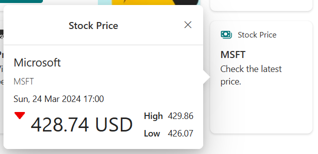
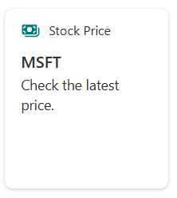
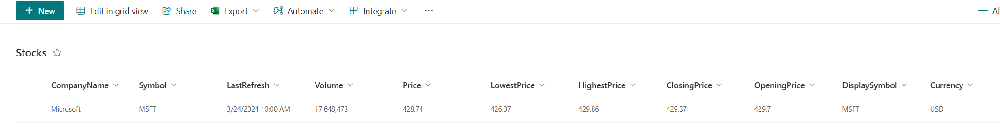
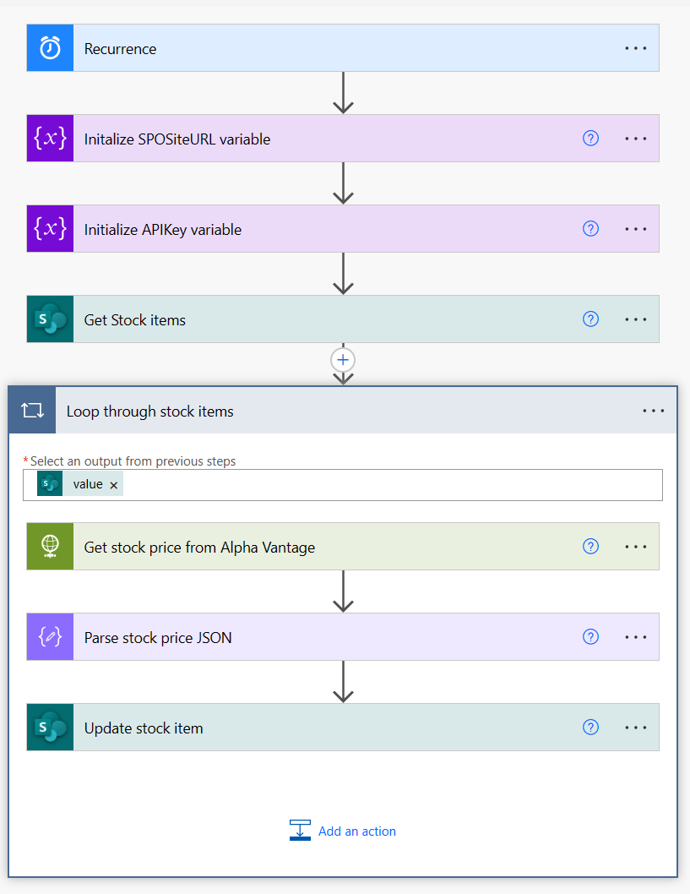

# Stock Price

## Summary

Simple card that leverages the Advance API Features functionality of the Card Designer to display a stock price. It uses a SharePoint list as the backend.

The quick view displays the company name, stock symbol, refresh date, latest price, highest price and lowest price.

The card is designed to display a single stock and therefore only displays the first list item (this could easily be updated to display multiple stocks).

Updating of the stock price in the list could be automated using a recurring Power Automate flow and a Stocks API.

A simple flow (GetStockPricesFlow.zip) is included with this sample to demonstrate how to automate the refresh of the stock price, feel free to use it and modify as needed. You will need an API key for the 'Alpha Vantage' Stocks API. **This flow requires a premium license for Power Automate as it leverages the HTTP connector.**

The card template demonstrates how to use if statements in adaptive cards to display different images based on data, in this sample arrows are used to indicate the movement of the stock price.

## Compatibility

## Advance API Features

## Designer

    

## Solution

Solution|Author(s)
--------|---------
stock-price | [Alex Clark](https://github.com/alexc-msft), Microsoft

## Version history

Version|Date|Comments
-------|----|--------
1.0|March 24, 2024|Initial release

## Disclaimer
**THIS CODE IS PROVIDED *AS IS* WITHOUT WARRANTY OF ANY KIND, EITHER EXPRESS OR IMPLIED, INCLUDING ANY IMPLIED WARRANTIES OF FITNESS FOR A PARTICULAR PURPOSE, MERCHANTABILITY, OR NON-INFRINGEMENT.**

## Minimal Path to Awesome

This design is originally created for Viva Connections Dashboard cards and can be used for story telling with the out of the box **Card designer** card for Viva Connections dashboard.

> See more details on the Viva Connections Dashboard capabilities from [Microsoft documentation](https://docs.microsoft.com/en-us/viva/connections/create-dashboard).

In order to use this sample you will need to have the 'Advance API Features' enabled, see the main [README](.\README) file for instructions. 

Create the SharePoint list:

- Create a new list in your Viva Connections Home Site named 'Stocks' with the following columns (ensure the internal names of the columns do not contain spaces):

    - CompanyName (Single line of text) - Name of the company to display in the quick view
    - Symbol (Single line of text) - Stock symbol for the stock
    - LastRefresh (Date and Time) - Last time the price was refreshed
    - Volume (Number) - Volume of the stock
    - Price (Number) - Current price of the stock
    - LowestPrice (Number) - Lowest daily price of the stock
    - HighestPrice (Number) - Highest daily price of the stock
    - ClosingPrice (Number) - Closing price of the stock
    - OpeningPrice (Number) - Opening price of the stock
    - Currency (Single line of text) - Currency to display in the quick view e.g. USD

- Populate the list with a single stock, making sure to fill out all columns. Refer to the column descriptions above for more info. 

**If you wish to use the flow below to refresh the stock price, make sure the symbol in the symbol column is correct in order for the Alpha Vantage API to retrieve the price.**

Steps to configure this card with *Card designer* as follows:

- Add a **Card designer** card to the Viva Connections Dashboard
- **Template Type** - Description
- **Card size** - Medium
- **Title** - *Stock Price*
- **Icon** - Icon with your preferred selection, suggest 'money'
- **Heading** - *Symbol for your stock e.g. MSFT*
- **Description** - Check the latest price.
- **Card action** - Show the quick view
- **Primary Button** - Off
- **Secondary Button** - Off
- **Template JSON** - Paste in the content of the *ac-qv-stock-price.json* file
- **Data souce** - Call a SharePoint API
- **Request URL** - lists/GetByTitle('Stocks')/items

Deploy the flow (optional):

- Deploy the 'Get Stock Prices' flow into your desired Power Platform environment (GetStockPricesFlow.zip).
- Edit the flow and replace the values for the following variables

    - SPOSiteURL - The URL to your Home Site that contains the 'Stocks' list.
    - APIKey - A valid Alpha Vantage API Key.

- Amend the recurrance as required (default is 1 day).
- Run the flow.
- Observe that the prices are updated in the Stocks list - debug the flow if neccessary. 

## Help

We do not support samples, but we this community is always willing to help, and we want to improve these samples. We use GitHub to track issues, which makes it easy for  community members to volunteer their time and help resolve issues.

You can try looking at [issues related to this sample](https://github.com/pnp/AdaptiveCards-Templates/issues) to see if anybody else is having the same issues.

