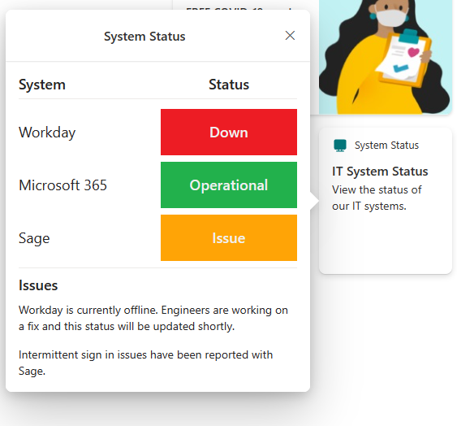
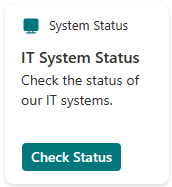
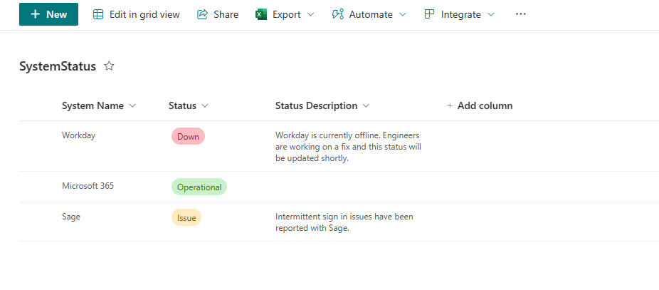

# System Status

## Summary

Simple card that leverages the Advance API Features functionality of the Card Designer to display the status of IT Systems. It uses a SharePoint list as the backend and each list item represents a separate system.

IT Admins would be responsible for maintaining the list and updating statuses and/or a process would be implemented to update them automatically.

The quick view displays the name of the system, the status and a list of any known issues.

The card template demonstrates how to use if statements in adaptive cards for conditional formatting.

## Compatibility

## Advance API Features

## Designer

    

## Solution

Solution|Author(s)
--------|---------
system-status | [Alex Clark](https://github.com/alexc-msft), Microsoft

## Version history

Version|Date|Comments
-------|----|--------
1.0|March 22, 2024|Initial release

## Disclaimer
**THIS CODE IS PROVIDED *AS IS* WITHOUT WARRANTY OF ANY KIND, EITHER EXPRESS OR IMPLIED, INCLUDING ANY IMPLIED WARRANTIES OF FITNESS FOR A PARTICULAR PURPOSE, MERCHANTABILITY, OR NON-INFRINGEMENT.**

## Minimal Path to Awesome

This design is originally created for Viva Connections Dashboard cards and can be used for story telling with the out of the box **Card designer** card for Viva Connections dashboard.

> See more details on the Viva Connections Dashboard capabilities from [Microsoft documentation](https://docs.microsoft.com/en-us/viva/connections/create-dashboard).

In order to use this sample you will need to have the 'Advance API Features' enabled, see the main [README](.\README) file for instructions. 

Create the SharePoint list:

- Create a new list in your Viva Connections Home Site named 'SystemStatus' with the following columns (ensure the internal names of the columns do not contain spaces):

    - System Name (Single line of text)
    - Status (Choice): 'Down', 'Operational', 'Issue'
    - Status Description (Single line of text)

- Populate the list with some example list item with a variety of statuses.

Steps to configure this card with *Card designer* as follows:

- Add a **Card designer** card to the Viva Connections Dashboard
- **Template Type** - Description
- **Card size** - Medium
- **Title** - *System Status*
- **Icon** - Icon with your preferred selection, suggest 'desktop'
- **Heading** - *IT System Status*
- **Description** - Check the status of our IT systems
- **Card action** - Show the quick view
- **Primary Button** - Off
- **Secondary Button** - Off
- **Template JSON** - Paste in the content of the *ac-qv-system-status.json* file
- **Data souce** - Call a SharePoint API
- **Request URL** - lists/GetByTitle('SystemStatus')/items

## Help

We do not support samples, but we this community is always willing to help, and we want to improve these samples. We use GitHub to track issues, which makes it easy for  community members to volunteer their time and help resolve issues.

You can try looking at [issues related to this sample](https://github.com/pnp/AdaptiveCards-Templates/issues) to see if anybody else is having the same issues.

