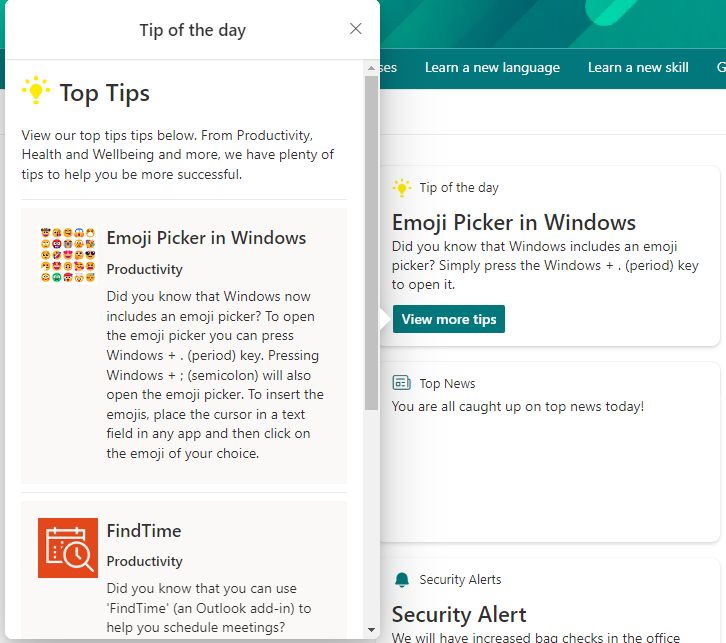
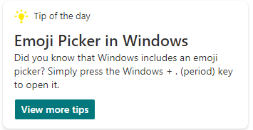

# Tip of the day/Top tips

## Summary

Simple card designed to show a tip of the day/top tips. 

The Data JSON option has been leveraged to enable users without advanced knowledge of JSON to easily add tips to the card. 

Users can simply update the data JSON to change the details of the tips. 

A single actionset button has been added to the quick view to link to a page with all tips e.g. a SharePoint page, SharePoint list or Microsoft Lists list. 

## Compatibility

## Advance API Features

## Designer

    

## Solution

Solution|Author(s)
--------|---------
top-tips | [Alex Clark](https://github.com/alexc-msft), Microsoft

## Version history

Version|Date|Comments
-------|----|--------
1.0|September 5, 2022|Initial release

## Disclaimer
**THIS CODE IS PROVIDED *AS IS* WITHOUT WARRANTY OF ANY KIND, EITHER EXPRESS OR IMPLIED, INCLUDING ANY IMPLIED WARRANTIES OF FITNESS FOR A PARTICULAR PURPOSE, MERCHANTABILITY, OR NON-INFRINGEMENT.**

## Minimal Path to Awesome

This design is originally created for Viva Connections Dashboard cards and can be used for story telling with the out of the box **Card designer** card for Viva Connections dashboard.

> See more details on the Viva Connections Dashboard capabilities from [Microsoft documentation](https://docs.microsoft.com/en-us/viva/connections/create-dashboard).

Steps to configure this card with *Card designer* as follows:

- Add **Card designer** to the Viva Connections Dashboard
- **Template Type** - Description
- **Card size** - Large
- **Title** - *Tip of the day*
- **Icon** - Use the icon provided with this sample [icon.png](assets/icon.png)
- **Heading** - *Name of your tip* e.g. Emoji Picker in Windows
- **Description** - *Description of your tip* e.g. "Did you know that Windows includes an emoji picker? Simply press the Windows + . (period) key to open it." 
- **Card action** - Show the quick view
- **Primary Button** - On
- **Secondary Button** - Off
- **Title** - *View more tips*
- **Action** - Show the quick view
- **Template JSON** - Paste in the content of the *ac-qv-toptips.json* file
- **Data JSON** - Paste in the content of the *ac-qv-toptips.data.json* file

## Help

We do not support samples, but we this community is always willing to help, and we want to improve these samples. We use GitHub to track issues, which makes it easy for  community members to volunteer their time and help resolve issues.

You can try looking at [issues related to this sample](https://github.com/pnp/AdaptiveCards-Templates/issues) to see if anybody else is having the same issues.

