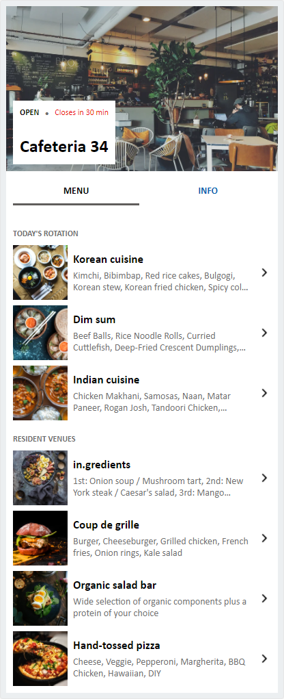

# Visual list with cafeteria menu scenario

## Summary

Design for a visual list with teh cafeteria scenario details, including two tab presentation

## Compatibility

Solution|Author(s)
--------|---------
event-schedule | Max Kulakov, Microsoft & [Vesa Juvonen](https://github.com/vesajuvonen) ([@vesajuvonen](https://twitter.com/vesajuvonen)), Microsoft

## Version history

Version|Date|Comments
-------|----|--------
1.0|December 28, 2021|Initial release

## Disclaimer
**THIS CODE IS PROVIDED *AS IS* WITHOUT WARRANTY OF ANY KIND, EITHER EXPRESS OR IMPLIED, INCLUDING ANY IMPLIED WARRANTIES OF FITNESS FOR A PARTICULAR PURPOSE, MERCHANTABILITY, OR NON-INFRINGEMENT.**

## Help

We do not support samples, but we this community is always willing to help, and we want to improve these samples. We use GitHub to track issues, which makes it easy for  community members to volunteer their time and help resolve issues.

You can try looking at [issues related to this sample](https://github.com/pnp/AdaptiveCards-Templates/issues) to see if anybody else is having the same issues.

